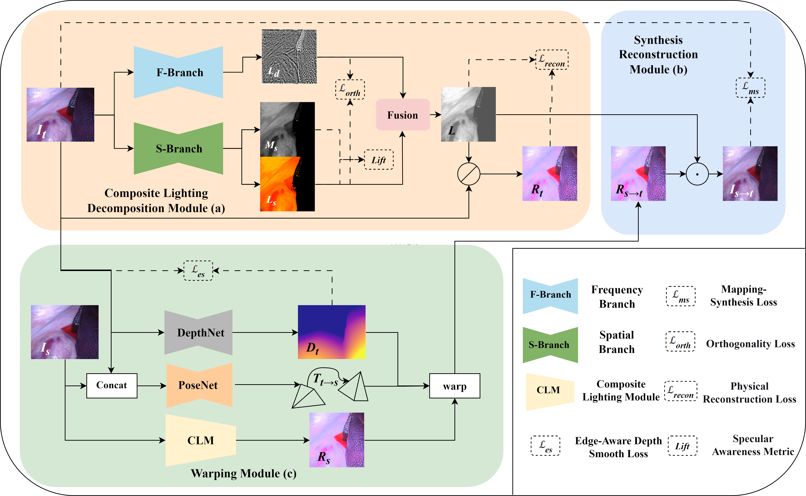

# CLD-Net: Physical Illumination Decomposition for Robust Monocular Depth Estimation in Endoscopic Surgery

This is the official PyTorch implementation for evaluating depth estimation models using the method described in

> **Physical Illumination Decomposition for Robust Monocular Depth Estimation in Endoscopic Surgery**
> Li Ma, Mingyue Wang, Zeyan Niu, Huijun Liu, Juntao Dai

## Overview

## ⚙️ Setup
We ran our experiments with PyTorch 1.11.0, CUDA 11.2, Python 3.8 and Ubuntu 18.04.

## 💾 Datasets
You can download the [SCARED](https://doi.org/10.57702/4chdgahp) dataset by signing the challenge rules and emailing to max.allan@intusurg.com, you can download the Hamlyn dataset from [https://hamlyn.doc.ic.ac.uk/vision/](https://hamlyn.doc.ic.ac.uk/vision/).
### Endovis split
The train/test/validation split for Endovis dataset used in our works is defined in the  `splits/endovis`  folder.
### Data structure
The directory of dataset structure is shown as follows:
"
/path/to/scared_data/
dataset1/
keyframe1/
000001.png
...
"
## 🖼️ Evaluation

You can download our trained model for evaluation from the following link: [Google Drive(https://drive.google.com/drive/folders/1b5wOZhS6GyCGCFLEUavXlVyanIUpALyP?usp=sharing)

To prepare the ground truth depth maps run:
"
python export_gt_depth.py --data_path <your_data_path>
"

You can evaluate a model by running the following command:
"
python evaluate_depth.py --data_path <your_data_path> --load_weights_folder <your_model_path> --eval_split <your_dataset_type>
"
## ✏️ Acknowledgement
Our code is based on the implementation of AF-SfMLearner and Monodepth2. We thank these authors for their excellent work and repository.
